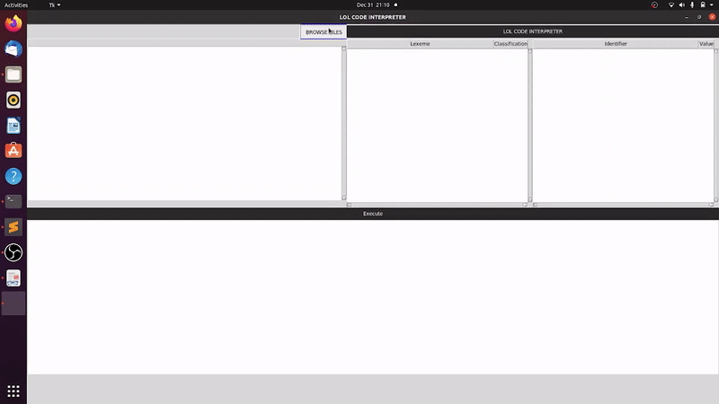

# LOL-Code Interpreter using Python

### Requirements:

- To run the program, the user must have python 3 installed on their device.
- The program still is not working properly for Windows system so only Linux system is recommended in running the program.
- Make sure also that your python installation actually has the library for Tkinter. (Tkinter is built in with python when you install it, but some system that comes pre-installed with python3 does not have the necessary library to run the program.)
- To install python:
run `sudo apt install python3` (for debian based system and replace apt install with the command corresponding to your package manager.)
- To install Tkinter libraries:
run `sudo apt instsall python3-tk`

- If the user wish to use windows, be sure to have Windows Subsystem For linux (WSL) and a linux distribution of their choice installed, as well as Xming for the GUI to actually display.

- To install WSL, follow the instruction from this website: https://docs.microsoft.com/en-us/windows/wsl/install-win10

- To install Xming, download the program from this site https://sourceforge.net/projects/xming/ and follow the installation wizard.

- To connect your WSL terminal to the xming display server, just type this command:
`export DISPLAY=:0`
This will allow WSL to display the graphical user interface of the program to show up on the screen.

### Running the program:
- Make sure that the current working directory contains all the necessary .py files.
- Run the program by typing in the command `python3 interpreter.py`
- The program will now start and the user can now use the interpreter.

*README.md written by John Mel Ramos*
